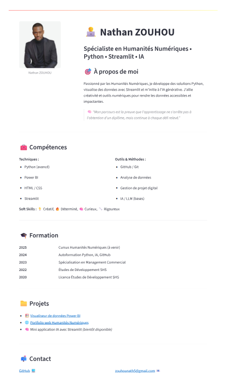

# CV interactif de Nathan ZOUHOU avec Streamlit

Ce projet est un CV numérique interactif, moderne et responsive, développé avec Python et Streamlit.  
Il présente mon parcours, mes compétences techniques et projets dans le domaine des humanités numériques, de la data, et du développement Python.

---

## Fonctionnalités principales

**Présentation interactive** : un CV moderne et visuel, facile à naviguer.
- **Sections détaillées** : organisation claire de l'expérience professionnelle, de la formation académique et des compétences.
- **Compétences techniques & soft skills** : mise en avant des expertises en Python, Streamlit, Power BI, GitHub, analyse de données, ainsi que des qualités personnelles.
- **Intégration de projets** : liens directs vers des réalisations concrètes.
- **Approche Humanités Numériques** : combinaison de la créativité et des outils numériques pour rendre les données accessibles et impactantes, avec une initiation à l'IA générative.

---

## Technologies utilisées

- **Python 3.x**  
- **Streamlit**
  
---

## Installation et lancement

Pour exécuter ce projet localement, suivez ces étapes :

1. **Cloner ce dépôt** :
   ```bash
   git clone https://github.com/VOTRE_USERNAME/streamlit-cv.git
   cd streamlit-cv

2.  **Installer les dépendances** :
    ```bash
    pip install -r requirements.txt
    ```
    
3.  **Exécuter l'application Streamlit** :
    ```bash
    streamlit run app.py  # Remplacez "app.py" par le nom de votre fichier principal si différent
    ```

## À Propos 
 
Ce dépôt présente mon **Portfolio Interactif et CV** développé en Python avec le framework **Streamlit**. 
L'objectif de ce projet est de transformer un CV traditionnel en une application web dynamique et engageante, offrant une exploration interactive de mon parcours professionnel, de mes compétences et de mes réalisations.
  
```
Développé par Nathan.Z
```



##  Résultat en ligne 

Accédez à l’application interactivement ici :  
[Ouvrir l’application Streamlit](https://cvinteractif.streamlit.app/)
